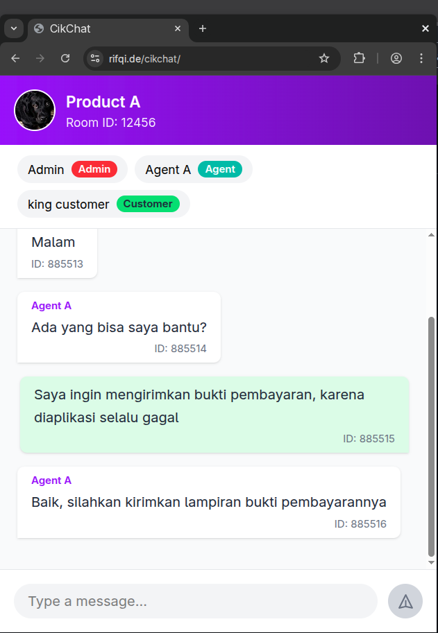

# CikChat

Just a chat interface preview built with Vue + Vite. Also see the [EXTENDED version](https://github.com/erhaem/cikchat/tree/feature/extended), it has media attachment support.

## Demo

- [Original version](https://erhaem.github.io/cikchat)
- [Extended version](https://erhaem.github.io/cikchat/extended)

## Screenshot



## Develop

```bash
npm install
npm run dev
```

## Build

```bash
npm run build
```

## Deploy to GitHub Pages

```bash
npm run deploy
```
