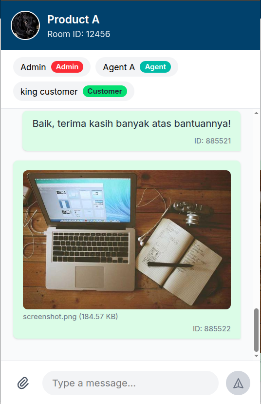

# CikChat

Just an EXTENDED version of chat interface preview with media (image, video, pdf) attachment support added, built with Vue + Vite. See the original version's source code [here](https://github.com/erhaem/cikchat/tree/main).

Also check for the extended [chat_response.json](public/chat_response.json)

## Demo

- [Original version](https://erhaem.github.io/cikchat)
- [Extended version](https://erhaem.github.io/cikchat/extended)

## Screenshot



## Develop

```bash
npm install
npm run dev
```

## Build

```bash
npm run build
```

## Deploy to GitHub Pages

```bash
npm run deploy
```
